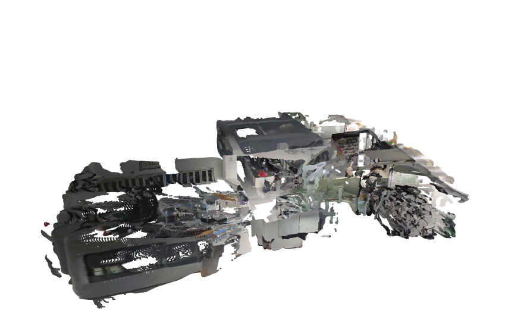
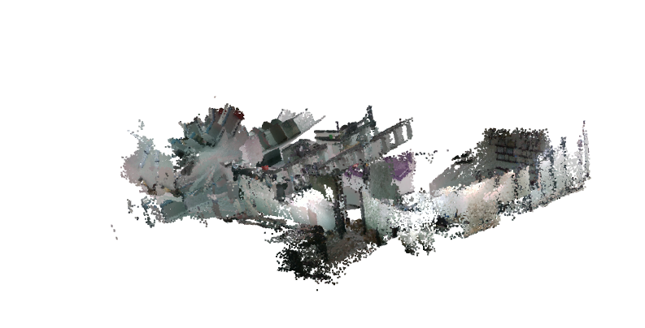

# Examination of several Latest "SLAM"/reconstruction systems in robot exploration mode
## 👥 Test Subjects:
✅[Mast3r-SLAM](https://github.com/rmurai0610/MASt3R-SLAM) 
✅[DA3-Streaming](https://github.com/ByteDance-Seed/Depth-Anything-3/blob/main/da3_streaming/README.md)

🎯VGGT-SLAM
🎯VGGT-Long

## brief contrast
<figure>
  
  <figcaption style="text-align: center;">Mast3r-SLAM Video Result</figcaption>
</figure>

<figure>
  
  <figcaption style="text-align: center;">Depth-Anything-3 Video Result</figcaption>
</figure>

## visualization (by yourself)
The result ply pointcloud and input video is [here in google drive](https://drive.google.com/drive/folders/1SfVfq0hAM5SD_vkz78YnghIhMG5KsTi6?usp=drive_link) or [here in aliyun drive](https://www.alipan.com/s/2nt3dkeBV3Z), you can download it and use the ``visualize_ply.py`` to visualize the result on your device.
## input modality
We examinates two modality: images and video

## data collector
### 📸image modality
The images are taken from Unitree Go2 robot at its height.
The robot will take an image after it stabilizes, and then it moves.
This approach is more real-world application related. 
### 🎥video
The video is recorded with a cellphone camera at human height.
Since this modality is more similar to their training data, it is assumed to have better performance. 

However, there are some differences compared to "dataset videos":
- The **camera rotates frequently** to mimic robot "exploring/navigating" in real-world scenarios rather than going straight and following building structure 
- The camera may directly face walls or obstacles 
- More **dynamic and unstructured movements** compared to standard datasets 
## current conclusion
### video modality
- Mast3r-SLAM with video has best performance.
- Performance degrades when video contains frequent rotations or faces blank surfaces
- Certain SLAM system requires the video to be "good quality" and align with building structure

## contribution
We welcome contributions! Please feel free to submit a Pull Request with:

-    🆕 New test videos/images
-    📈 Corresponding experimental results
-    📊 Other Performance comparisons
    
Your contributions help make this benchmark more comprehensive and valuable for the community! 
